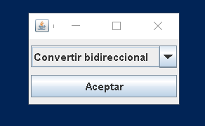
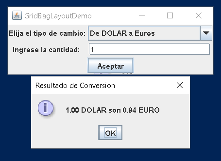
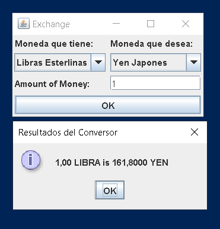

# ConversorOne
Conversor de monedas con 2 funcionalidades:
- De MonedaNacional a Euro,Yen,Won,Dolar, etc.
- Funcionalidad bidireccional, es decir, poder cambiar de las monedas disponibles a cualquier moneda.

Las conversiones son estática por el momento.

## Descarga

Para descargar la aplicación:
- Descargue el archivo `conv.jar` [aqui](./bin/conv.jar). Tambien puede encontrarlo en la siguiente ruta `./bin/conv.jar`

## Ejecución
Puede ejecutar el programa con el siguiente comando:
```console
java -jar conv.jar
```
# Imagenes

- Main Menu:

- Unidireccional option:

- Bidireccional option:
